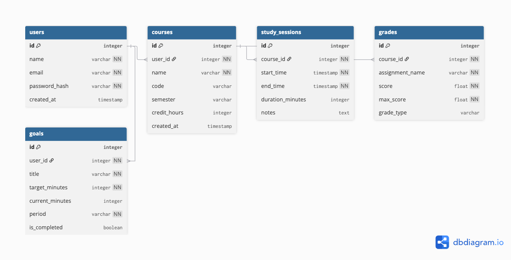

# StudySync API

A backend REST API built with ASP.NET Core and PostgreSQL for tracking study sessions, managing courses, setting goals, and calculating GPA — designed for students who want to take control of their academic performance.

---

## Table of Contents

- [Overview](#overview)
- [Tech Stack](#tech-stack)
- [Project Structure](#project-structure)
- [Database Schema](#database-schema)
- [Getting Started](#getting-started)
- [Environment Setup](#environment-setup)
- [Running the Project](#running-the-project)
- [API Endpoints](#api-endpoints)
- [Key Concepts](#key-concepts)
- [Author](#author)

---

## Overview

StudySync is a RESTful API that allows students to:

- Register and log in securely
- Add and manage courses per semester
- Log study sessions with duration and notes
- Track grades and calculate GPA
- Set weekly or monthly study goals

---

## Tech Stack

| Technology | Purpose |
|---|---|
| .NET 9 | Backend framework |
| ASP.NET Core | Web API |
| Entity Framework Core 9 | ORM / Database management |
| PostgreSQL 17 | Relational database |
| Npgsql | PostgreSQL provider for EF Core |
| Docker | Containerized database environment |
| pgAdmin 4 | Database GUI |

---

## Project Structure

```
StudySync/
├── docs/
│   └── studysync-schema.png        # Database schema diagram
│
├── StudySync.API/
│   ├── Controllers/                # API endpoints (request/response handling)
│   ├── Data/
│   │   └── AppDbContext.cs         # EF Core database context
│   ├── DTOs/                       # Data Transfer Objects (safe data shapes)
│   │   ├── UserRegisterDto.cs
│   │   ├── UserLoginDto.cs
│   │   └── UserResponseDto.cs
│   ├── Migrations/                 # Auto-generated EF Core migration files
│   ├── Models/                     # Database table representations
│   │   ├── User.cs
│   │   ├── Course.cs
│   │   ├── StudySession.cs
│   │   ├── Grade.cs
│   │   └── Goal.cs
│   ├── appsettings.json            # App configuration and connection string
│   ├── appsettings.Development.json
│   └── Program.cs                  # App entry point and service registration
│
└── docker-compose.yml              # PostgreSQL and pgAdmin container setup
```

---

## Database Schema



### Tables

**Users** — stores registered users
| Column | Type | Notes |
|---|---|---|
| Id | integer | Primary key, auto increment |
| Name | text | Not null |
| Email | text | Unique, not null |
| PasswordHash | text | Bcrypt hashed, never plain text |
| CreatedAt | timestamp | Defaults to current time |

**Courses** — courses per user per semester
| Column | Type | Notes |
|---|---|---|
| Id | integer | Primary key |
| UserId | integer | Foreign key → Users |
| Name | text | Not null |
| Code | text | e.g. CSC474 |
| Semester | text | e.g. Fall 2025 |
| CreditHours | integer | Used for GPA calculation |
| CreatedAt | timestamp | Defaults to current time |

**StudySessions** — study time logs per course
| Column | Type | Notes |
|---|---|---|
| Id | integer | Primary key |
| CourseId | integer | Foreign key → Courses |
| StartTime | timestamp | Not null |
| EndTime | timestamp | Not null |
| DurationMinutes | integer | Calculated from start/end |
| Notes | text | Optional session notes |

**Grades** — individual assignment/exam grades
| Column | Type | Notes |
|---|---|---|
| Id | integer | Primary key |
| CourseId | integer | Foreign key → Courses |
| AssignmentName | text | e.g. Midterm Exam |
| Score | float | Points earned |
| MaxScore | float | Total possible points |
| GradeType | text | e.g. exam, homework, quiz |

**Goals** — study goals per user
| Column | Type | Notes |
|---|---|---|
| Id | integer | Primary key |
| UserId | integer | Foreign key → Users |
| Title | text | Goal description |
| TargetMinutes | integer | Target study time |
| CurrentMinutes | integer | Progress so far |
| Period | text | weekly or monthly |
| IsCompleted | boolean | Defaults to false |

---

## Getting Started

### Prerequisites

Make sure you have the following installed:

- [.NET 9 SDK](https://dotnet.microsoft.com/download)
- [Docker Desktop](https://www.docker.com/products/docker-desktop)
- [VS Code](https://code.visualstudio.com/)

### VS Code Extensions

Install these extensions for the best experience:

```bash
code --install-extension ms-dotnettools.csdevkit
code --install-extension ms-dotnettools.csharp
code --install-extension cweijan.vscode-postgresql-client2
code --install-extension humao.rest-client
code --install-extension pkief.material-icon-theme
```

---

## Environment Setup

### 1. Clone the repository

```bash
git clone https://github.com/your-username/StudySync.git
cd StudySync
```

### 2. Start the database

```bash
docker compose up -d
```

This starts:
- PostgreSQL on `localhost:5432`
- pgAdmin on `http://localhost:5050`

pgAdmin credentials:
- Email: `admin@email.com`
- Password: `test1234`

### 3. Configure connection string

Open `StudySync.API/appsettings.json` and verify:

```json
{
  "ConnectionStrings": {
    "DefaultConnection": "Host=localhost;Port=5432;Database=test_db;Username=admin;Password=admin1234"
  }
}
```

---

## Running the Project

### 1. Navigate to the API project

```bash
cd StudySync.API
```

### 2. Restore packages

```bash
dotnet restore
```

### 3. Apply database migrations

```bash
dotnet ef database update
```

### 4. Run the API

```bash
dotnet run
```

The API will start at `http://localhost:5202`

---

## API Endpoints

### Auth

| Method | Endpoint | Description | Auth Required |
|---|---|---|---|
| POST | `/users/register` | Register a new user | No |
| POST | `/users/login` | Login and receive token | No |

### Courses

| Method | Endpoint | Description | Auth Required |
|---|---|---|---|
| GET | `/courses` | Get all courses for user | Yes |
| POST | `/courses` | Create a new course | Yes |
| PUT | `/courses/{id}` | Update a course | Yes |
| DELETE | `/courses/{id}` | Delete a course | Yes |

### Study Sessions

| Method | Endpoint | Description | Auth Required |
|---|---|---|---|
| GET | `/sessions` | Get all study sessions | Yes |
| POST | `/sessions` | Log a new study session | Yes |
| DELETE | `/sessions/{id}` | Delete a session | Yes |

### Grades

| Method | Endpoint | Description | Auth Required |
|---|---|---|---|
| GET | `/grades` | Get all grades | Yes |
| POST | `/grades` | Add a new grade | Yes |
| DELETE | `/grades/{id}` | Delete a grade | Yes |

### Goals

| Method | Endpoint | Description | Auth Required |
|---|---|---|---|
| GET | `/goals` | Get all goals | Yes |
| POST | `/goals` | Create a new goal | Yes |
| PUT | `/goals/{id}` | Update goal progress | Yes |
| DELETE | `/goals/{id}` | Delete a goal | Yes |

---

## Key Concepts

### Code First Approach
This project uses EF Core's Code First approach — meaning database tables are generated from C# model classes, not written in SQL manually. Any changes to models are applied via migrations.

```bash
# Create a new migration after changing a model
dotnet ef migrations add MigrationName

# Apply migration to database
dotnet ef database update
```

### DTOs (Data Transfer Objects)
Models are never exposed directly through the API. DTOs control exactly what data goes in and out, keeping sensitive fields like `PasswordHash` hidden from responses.

### Docker
The database runs in a Docker container so there is no need to install PostgreSQL directly on your machine. The `docker-compose.yml` file defines both the PostgreSQL and pgAdmin services.

```bash
docker compose up -d    # start containers
docker compose down     # stop containers
docker ps               # check running containers
```

---

## Author

**Rikesh Budhathoki**
Computer Science Student — South Dakota State University
AI & Computer Vision Enthusiast

- Portfolio: [rikeshbudhathoki.netlify.app](https://rikeshbudhathoki.netlify.app)
- GitHub: [@reekesh](https://github.com/reekesh)
- LinkedIn: [Rikesh Budhathoki](https://linkedin.com/in/rikesh-budhathoki)